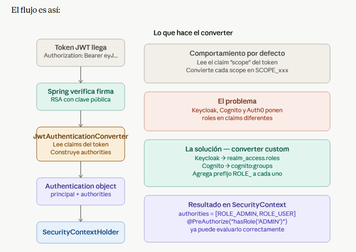

# module-cognito — Spring Security con AWS Cognito

> Módulo educativo del proyecto `spring-security-lab`.  
> Puerto: **8083** | Authorization Server: **AWS Cognito (User Pool)**

---

## ¿Qué problema resuelve este módulo?

En `module-keycloak` delegabas la autenticación a Keycloak,
pero **tú operabas** el servidor (Docker, actualizaciones, backups).
Aquí delegas completamente a AWS — Cognito es un servicio
gestionado, serverless, sin infraestructura que mantener.

---

## Cognito vs Keycloak — diferencias prácticas

| Aspecto | Keycloak | Cognito |
|---|---|---|
| ¿Quién lo opera? | Tú (Docker / VM) | AWS (serverless) |
| Configuración | Realm + Client | User Pool + App Client |
| Roles en token | `realm_access.roles` | `cognito:groups` |
| Username en token | `preferred_username` | `username` (UUID interno) |
| Email en Access Token | Sí | No — solo en ID Token |
| Firma | RSA (tu clave) | RSA (clave de AWS) |
| Código Spring Boot | 3 archivos | 3 archivos (igual) |

---

## La gran lección de este módulo

El código de Spring Boot es prácticamente idéntico al de Keycloak.
Solo cambia:
1. El `issuer-uri` en `application.yml`
2. El nombre del claim de roles (`cognito:groups` vs `realm_access.roles`)
3. El nombre del claim de username (`username` vs `preferred_username`)

Spring descarga la clave pública RSA de AWS automáticamente desde:
```
https://cognito-idp.{region}.amazonaws.com/{userPoolId}/.well-known/jwks.json
```
Y verifica cada token sin contactar a Cognito en cada request.

---

## App Client — ¿qué es y por qué existe?

El **App Client** es el registro de tu aplicación ante el Authorization Server.
Le dice a Cognito (o Auth0, o Keycloak) "esta app tiene permiso de
solicitar tokens para mis usuarios".

### ¿Por qué se configura en el Authorization Server y no en Spring Boot?

Porque la confianza va en esa dirección: **el Authorization Server decide
quién puede pedirle tokens**, no al revés. Tu app Spring Boot solo verifica
que el token fue emitido por un issuer de confianza — no necesita saber
nada del App Client.

### Comparación entre módulos

| | Keycloak | Cognito | Auth0 |
|---|---|---|---|
| Nombre del concepto | Client | App Client | Application |
| ¿Dónde se crea? | Admin console / CLI | AWS Console / CLI | Auth0 Dashboard / CLI |
| ¿Tiene secret? | Opcional | Opcional (`--no-generate-secret`) | Sí (client_secret) |
| ¿Lo usa Spring Boot? | No — solo el issuer-uri | No — solo el issuer-uri | No — solo el issuer-uri |
| ¿Para qué sirve? | Definir flujos y redirect URIs | Definir flujos de auth permitidos | Definir flujos y redirect URIs |

### Flujos de autenticación (explicit-auth-flows en Cognito)

| Flujo | Cuándo usarlo |
|---|---|
| `ALLOW_USER_PASSWORD_AUTH` | Pruebas con curl, apps móviles legacy |
| `ALLOW_REFRESH_TOKEN_AUTH` | Renovar tokens expirados |
| `ALLOW_USER_SRP_AUTH` | Producción — password nunca viaja en claro |
| Authorization Code Flow | SPAs y apps web con redirect |

> **Para entrevistas:** En producción nunca uses `USER_PASSWORD_AUTH`
> porque el password viaja en la petición HTTP. Usa `USER_SRP_AUTH`
> (Secure Remote Password) donde el password se verifica
> criptográficamente sin transmitirlo.

---

## Access Token vs ID Token en Cognito

Esta es la lección más importante del módulo — la aprendimos
en la práctica cuando `/api/me` devolvía `email: null`.

| | Access Token | ID Token |
|---|---|---|
| Propósito | Autorizar llamadas a APIs | Identificar al usuario |
| Contiene | `cognito:groups`, `scope`, `client_id` | `email`, `name`, `phone_number` |
| `username` | UUID interno del usuario | UUID interno del usuario |
| Cuándo usarlo | En el header `Authorization` de tus APIs | Para obtener datos del perfil |

En producción, si necesitas el email en tu API tienes dos opciones:
- Usar el ID Token en lugar del Access Token
- Llamar a `cognito-idp:getUser` con el Access Token

---

## Infraestructura creada en AWS

```bash
# User Pool
aws cognito-idp create-user-pool \
  --pool-name security-lab-pool \
  --region us-east-1

# App Client (sin secret — flujo directo para pruebas)
aws cognito-idp create-user-pool-client \
  --user-pool-id {userPoolId} \
  --client-name spring-lab-client \
  --explicit-auth-flows ALLOW_USER_PASSWORD_AUTH ALLOW_REFRESH_TOKEN_AUTH \
  --no-generate-secret

# Grupo equivalente a un rol
aws cognito-idp create-group \
  --user-pool-id {userPoolId} \
  --group-name ADMIN

# Usuario de prueba
aws cognito-idp admin-create-user \
  --user-pool-id {userPoolId} \
  --username admin@example.com \
  --temporary-password Temp1234! \
  --message-action SUPPRESS

# Contraseña permanente (Cognito crea usuarios en FORCE_CHANGE_PASSWORD)
aws cognito-idp admin-set-user-password \
  --user-pool-id {userPoolId} \
  --username admin@example.com \
  --password Password123! \
  --permanent

# Asignar rol
aws cognito-idp admin-add-user-to-group \
  --user-pool-id {userPoolId} \
  --username admin@example.com \
  --group-name ADMIN
```

---

## Obtener token para pruebas

```bash
aws cognito-idp initiate-auth \
  --auth-flow USER_PASSWORD_AUTH \
  --auth-parameters USERNAME=admin@example.com,PASSWORD=Password123! \
  --client-id {clientId} \
  --region us-east-1
```

Usa el `AccessToken` de la respuesta en el header `Authorization`.

---

## Endpoints disponibles

| Método | Ruta | Acceso | Descripción |
|---|---|---|---|
| GET | `/api/public/hello` | Público | Sin token |
| GET | `/api/hello` | Autenticado | Username del token |
| GET | `/api/me` | Autenticado | Claims completos del token |
| GET | `/api/admin` | `ROLE_ADMIN` | Solo grupo ADMIN |

---

## Pruebas con curl

```bash
# 1. Público
curl http://localhost:8083/api/public/hello

# 2. Protegido
curl http://localhost:8083/api/hello \
  -H "Authorization: Bearer {accessToken}"

# 3. Claims
curl http://localhost:8083/api/me \
  -H "Authorization: Bearer {accessToken}"

# 4. Admin
curl http://localhost:8083/api/admin \
  -H "Authorization: Bearer {accessToken}"

# 5. Sin token — debe dar 401
curl http://localhost:8083/api/hello
```

---

## Preguntas de entrevista que cubre este módulo

**Sobre Cognito:**
- ¿Qué es AWS Cognito y para qué se usa?
- ¿Cuál es la diferencia entre un User Pool y un Identity Pool?
- ¿Qué diferencia hay entre el Access Token y el ID Token de Cognito?
- ¿Por qué el email no viene en el Access Token de Cognito?
- ¿Cómo invalidas un token de Cognito?
- ¿Qué ventaja tiene Cognito sobre Keycloak en producción?

**Sobre App Client (aplica a Cognito, Auth0 y Keycloak):**
- ¿Qué es un App Client / Application / Client en OAuth2?
- ¿Por qué se configura en el Authorization Server y no en Spring Boot?
- ¿Cuál es la diferencia entre un client público y uno confidencial?
- ¿Cuándo usarías `USER_PASSWORD_AUTH` vs `USER_SRP_AUTH`?

**Sobre Spring Boot:**
- ¿Cómo verifica Spring Boot un token de Cognito sin llamar a AWS en cada request?
- ¿Cómo escala este esquema horizontalmente?
- ¿Qué cambiarías en el código para pasar de Keycloak a Cognito?

---

## Stack del módulo

- Spring Boot 3.3.5
- Spring Security OAuth2 Resource Server
- AWS Cognito (User Pool)
- Sin base de datos

¿Qué hace JwtAuthenticationConverter?
Su trabajo es tomar el token JWT ya verificado y convertirlo en un objeto Authentication que Spring Security entiende 



JwtAuthenticationConverter es el puente entre el mundo de OAuth2 (claims en el token) y el mundo de Spring Security (authorities en el contexto). Sin él, Spring no sabría dónde están tus roles dentro del token